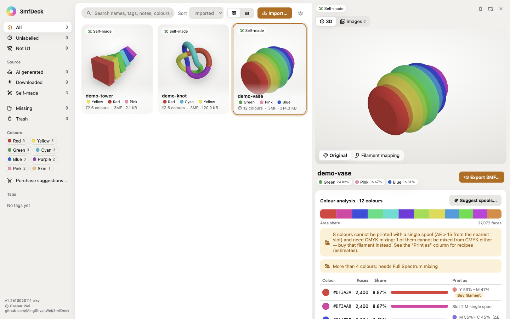
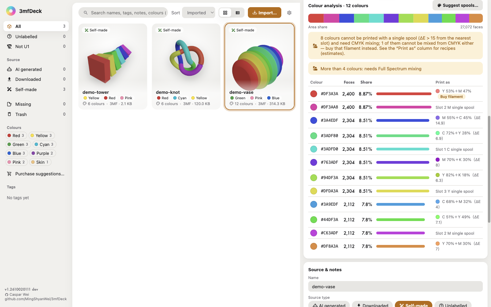
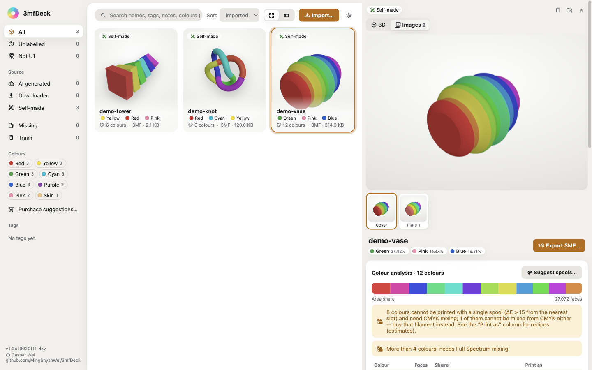
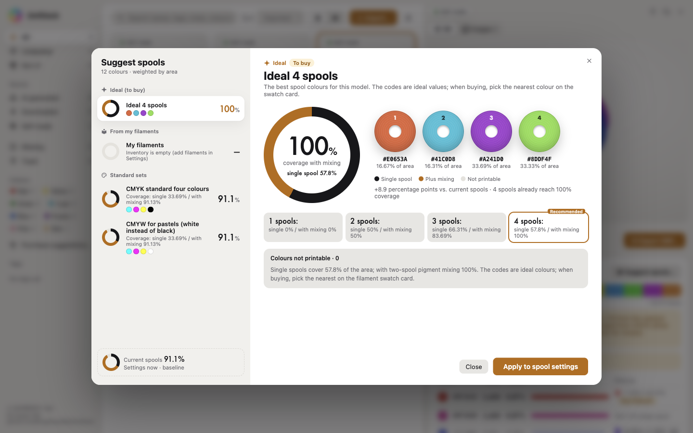
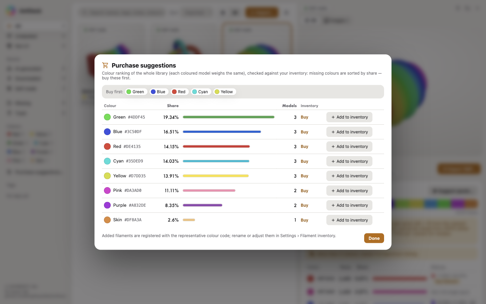

# 3mfDeck

**English** · [繁體中文](README.zh-TW.md) · [简体中文](README.zh-CN.md)

**An offline 3MF library and filament colour advisor.**

Collect the 3MF files scattered across your disk, MakerWorld and Meshy into one library: see them in 3D, understand their colours, work out which spools to load, and export files that open and print straight away in Snapmaker Orca.



---

## Why

Downloading models is easy; the trouble starts afterwards:

| Pain point | How 3mfDeck solves it |
|---|---|
| Files everywhere; which one is the original, which one a conversion? | Importing **moves** files into one library folder (`~/3mf-library/`, changeable in Settings). The file system is the truth; the database is only an index |
| You only know what a file looks like after opening it | **3D preview** right in the library; MakerWorld projects also show the **creator's product images and photos** |
| Which spools does this model need? | **Colour analysis** (area-weighted) + **spool suggestions** (Lab k-means — if 3 spools do, it won't tell you to buy 4) |
| Full Spectrum mixing is guesswork | Mix **detection and recipes**: a two-spool pigment model computes the mixed colour and its ΔE, and tells you which slot at what % |
| Exported 3MF files open in Orca with a pile of warnings | **Export 3MF**: strips incompatible slicer settings, writes only geometry + colours + spool table; mixes are written as Orca's native Mix virtual extruders |
| Shared files are set up for someone else's printer | **Snapmaker U1 compatibility check**: non-U1 files are flagged (with the source printer) and can be converted in one click (nozzle matching, compatibility fixes, multi-plate coordinate conversion) |
| Deleted the wrong file | Everything goes to `.trash/` and can be restored — nothing is really deleted; same names are never overwritten (`-2` is added) |

---

## Features

**Library**
- Import (files / folders / drag and drop), search, tags, source records (MakerWorld / Printables / Meshy / self-made…), sorting, card and table views
- Missing files: when records no longer match (e.g. after changing the library folder) they are marked “missing” and can be relocated or removed
- Multi-plate 3MF: each plate listed separately, switchable in the viewer

**3D preview**
- three.js rendering with three shading modes (original colours / filament mapping / mix estimate)
- The detail panel can switch to “Images” to show the 3MF's embedded cover, creator photos and Orca plate renders
- Card thumbnails use the embedded product image first and fall back to a 3D render

**Colours and filaments**
- Colour analysis: per-face `paint_color` / `basematerials` parsing, area-weighted shares, dither detection
- Colour labels: every colour is mapped to a fixed name (black / white / gray / red / orange / yellow / green / cyan / blue / purple / pink / brown / skin / gold) for searching and filtering; search accepts the name in any UI language (“blue”, 「藍」 and 「蓝」 all work)
- Filament inventory: register your own spools (brand, material, RGB, remaining amount); imports 3dfilamentprofiles JSON/CSV exports
  - On 3dfilamentprofiles.com, log in and export from [My Spools](https://3dfilamentprofiles.com/my/spools) (JSON or CSV), then in Settings › Filament inventory press **Import from 3dfilamentprofiles…** and pick the downloaded file (Settings shows the same steps and links to My Spools)
- Spool suggestions: pick from what you own, or get ideal colour codes; compare with the CMYK / CMYW standard sets; single-colour models get suggestions too
- Purchase suggestions: area shares across the whole library, checked against your inventory, tell you which colours to buy first

**Export**
- Export 3MF: quantized to the nearest spool (with ΔE), source slicer settings stripped to avoid Orca warnings
- Mixed filaments: written to `mixed_filament_definitions` (Orca's native Full Spectrum mixed filament); recipes are guidance only and never written back to the original
- Originals are never modified; every export is a new file

**UI language**
- English / 繁體中文 / 简体中文; follows the system language by default, can be switched in Settings and is remembered; dates and numbers are formatted for the language

**Network**
- Everything works offline: no account, no cloud, no printer connection; your files never leave your disk.
- **The only network activity of the whole app is the update check**: on by default, after startup, at most once every 24 hours, it asks the GitHub Releases API for the newest version — **which lets GitHub see your IP address**. Switch it off in Settings › Version & updates and the app makes no network request at all (see [Updates](#updates)).
- Links (author, Releases page, 3dfilamentprofiles.com My Spools) are only opened in your browser when you click them.
- The bottom of the sidebar shows the version `1.<YYMM>.<DHHMM>` (build time, e.g. `1.2610.21122`; the release file names carry the same string); hover for the full time and commit.

---

## Screenshots

All screenshots show the demo models generated by [`scripts/make-demo-models.mjs`](scripts/make-demo-models.mjs) (this project's own work) in a clean, temporary library; regenerate them with `node scripts/readme-screenshots.mjs`. The vase's “Images” are renders of the vase itself, embedded by that script.

| | |
|---|---|
|  **Colour analysis** — area shares, colour labels, how each colour prints |  **Images** — the cover and plate images embedded in the 3MF |
|  **Spool suggestions** — ideal colours, your inventory, standard sets |  **Purchase suggestions** — which colours your library needs most |

## Formats and platforms

| Item | Details |
|---|---|
| Model formats | 3MF (full support: colours, plates, embedded images, mixing), STL, OBJ, AMF, GLB / glTF, STEP |
| Platforms | macOS (main development and verification), Windows, Linux (**see limitations below**) |
| Runtime (development) | Node ≥ 24 (vitest / vite crash on Node 20) |

## Install

### Download from Releases

Download the file for your platform from [GitHub Releases](https://github.com/MingShyanWei/3mfDeck/releases) (`<version>` is the build version `1.<YYMM>.<DHHMM>`, e.g. `1.2610.21122` = 2026-10-02 11:22 — the same string the app shows at the bottom of the sidebar; the day is not zero-padded because semver forbids leading zeros). SHA256 checksums for each release are listed in [docs/release-manifest.md](docs/release-manifest.md).

| Platform | File | Notes |
|---|---|---|
| macOS (Apple silicon) | `3mfDeck-<version>-arm64.dmg` | Open it and drag 3mfDeck into Applications |
| Windows x64 | `3mfDeck-<version>-win-x64-setup.exe` | Installer (you can choose the folder) |
| Windows x64 | `3mfDeck-<version>-win-x64-portable.exe` | Portable, runs without installing |
| Linux x64 | `3mfDeck-<version>-linux-x64.AppImage` | `chmod +x`, then run it |
| Linux x64 (Debian / Ubuntu) | `3mfdeck_<version>_amd64.deb` | `sudo apt install ./3mfdeck_<version>_amd64.deb` |

**macOS: the app is unsigned (ad-hoc signature only, no Developer ID, not notarized)**, so Gatekeeper blocks the first launch. Either:
- right-click 3mfDeck in Applications → **Open** → **Open**; if there is no Open button, go to **System Settings › Privacy & Security** and click **Open Anyway** next to the 3mfDeck message; or
- run `xattr -dr com.apple.quarantine /Applications/3mfDeck.app` in Terminal, then open it normally.

Opening without this warning would need Apple Developer Program signing and notarization, which this release does not include.

**Windows:** the `.exe` files are not code-signed either; if SmartScreen warns, click **More info → Run anyway**.

### Updates

3mfDeck never downloads or installs updates itself — **updates are always downloaded and installed by hand** from [Releases](https://github.com/MingShyanWei/3mfDeck/releases) (in-app auto-update on macOS would need a Developer ID signature; this build is ad-hoc signed).

- **Settings › Version & updates** shows the current version and a button that opens the Releases page in your browser (no request from the app).
- **Check for updates automatically (connects to GitHub)** — **on by default**. In the background after startup, at most once every 24 hours, the app asks the GitHub Releases API for the newest release and compares the build marker in its notes (`<!-- build: 1.YYMM.DHHMM -->`) with your version. A newer one shows a small notice in the sidebar (go to download, skip this version, or close); the same version shows nothing. Startup never waits for it, and failures (offline, rate limit) are ignored silently.
- This request is the app's only network activity and lets GitHub see your IP address. **Switch it off and the app makes no network request at all.**

## Development

```bash
git clone git@github.com:MingShyanWei/3mfDeck.git
cd 3mfDeck
npm install
npm run dev        # vite build + start Electron
npm test           # Vitest unit tests (279)
npm run smoke      # Electron end-to-end smoke test (isolated folders and database)
npm run dist       # package the macOS dmg (file names carry the build version)
node scripts/release-notes.mjs  # release notes with the build marker, sizes and SHA256
```

Useful environment variables (for testing):

| Variable | Purpose |
|---|---|
| `MF_USER_DATA` | Use this userData folder (isolated tests) |
| `MF_APP_PATH` | Run the smoke test against the installed app (e.g. `/Applications/3mfDeck.app/Contents/MacOS/3mfDeck`) |
| `MF_WINE_3MF` | A real 3MF file for real-file verification |
| `MF_LANG` | UI language when none has been chosen in Settings (`en` / `zh-TW` / `zh-CN`) |

## Project layout

```
electron/          Electron main process (window, IPC, custom image protocols mfimg/mfthumb)
src/core/          Pure logic, testable on its own: parsing, colours, mixing, export, conversion, DB, settings
  parse/           3MF / STL / OBJ / AMF / GLB / STEP parsers
  u1Convert.mjs    Snapmaker U1 compatibility conversion
  orcaProfiles.mjs Reads the local Snapmaker Orca printer profiles (geometry only, no network)
src/core/i18n/     UI dictionaries (en / zh-TW / zh-CN)
src/renderer/      React UI (three.js preview, detail panel, dialogs)
tests/unit/        Vitest (33 files, 279 tests)
tests/smoke/       Real Electron end-to-end test
docs/screenshots/  README screenshots (en / zh-TW / zh-CN)
demo/models/       Procedural showcase models (regenerate: node scripts/make-demo-models.mjs)
scripts/           Fixture, demo-model and screenshot generators
SPEC.md            Full functional specification (final)
```

## Design principles

1. **The file system is the truth**: the DB is only an index and can be rebuilt from the files.
2. **Deleting never really deletes**: everything goes to `.trash/` and can be restored.
3. **Originals are never touched**: exports and conversions always create new files.
4. **Import means move**: one managed library; files are moved in on import.
5. **Works offline**: no feature needs the network; the update check is the only network activity and can be switched off.

## Known limitations

- **Windows / Linux not verified on real machines**: installers are built from macOS with electron-builder's bundled Wine / Linux toolsets (or on CI runners) and have not been smoke-tested on real hardware yet; macOS is the only platform verified end to end.
- **The Orca CLI cannot validate 3MF files**: without a printer profile loaded it segfaults (`exit 139`), even on the original file. Verification is always done by **opening the file in the Orca GUI**.
- **Mix recipes cannot be written per face as two spools**: Orca records one spool per face, so mixes are expressed as virtual extruders (Mix).
- **Large files**: models of 500 MB or more (e.g. some Meshy exports) need streaming parsing and take longer.

## License

**MIT** — see [LICENSE](LICENSE).

Third-party components keep their own licenses; see the notices in [LICENSE](LICENSE).
In short: the pigment mixing model is MIT (Justin Hayes, ported from
[OrcaSlicer-FullSpectrum](https://github.com/ratdoux/OrcaSlicer-FullSpectrum)); the
Snapmaker U1 conversion is original to this project and reads machine geometry from a
locally installed Snapmaker Orca at runtime.

## Author

**Caspar Wei** ([@MingShyanWei](https://github.com/MingShyanWei)) — [github.com/MingShyanWei/3mfDeck](https://github.com/MingShyanWei/3mfDeck)
