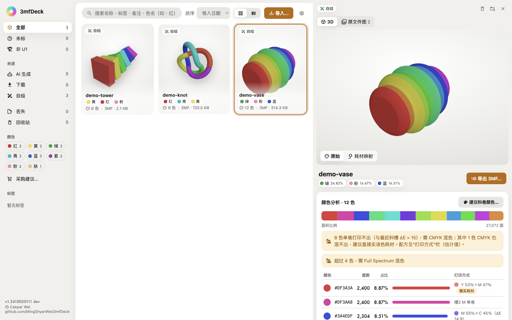
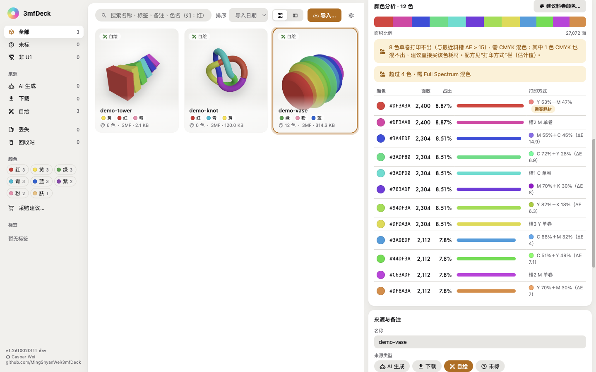
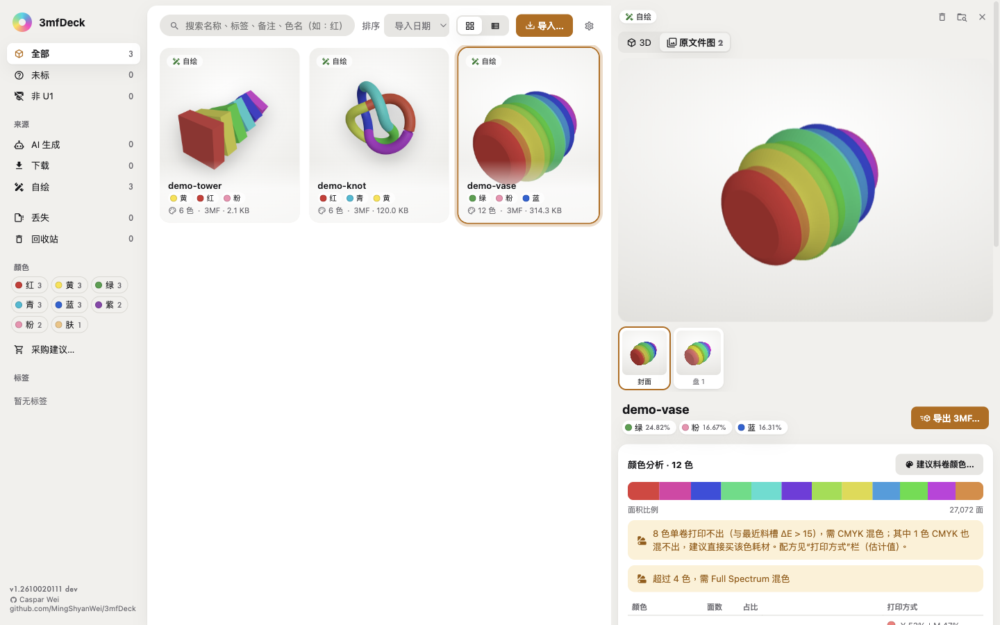
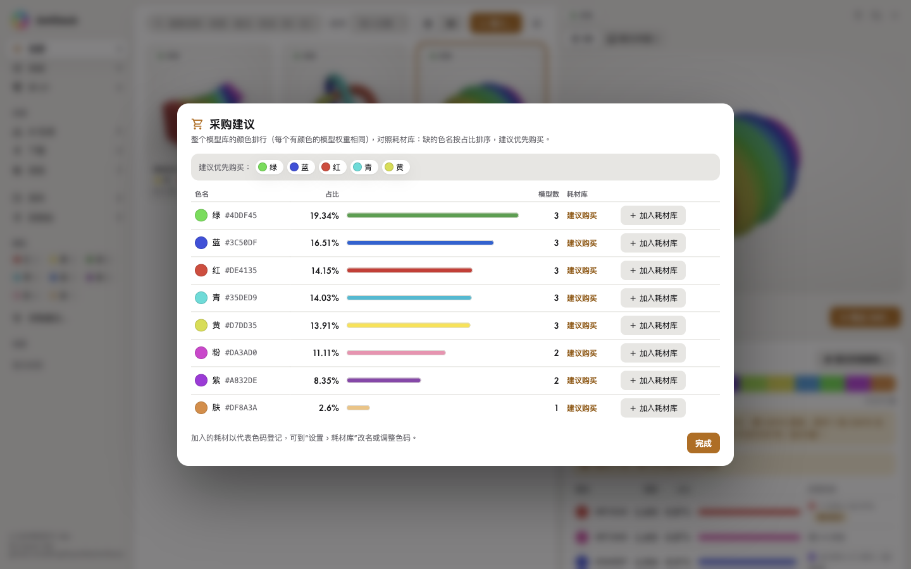

# 3mfDeck

[English](README.md) · [繁體中文](README.zh-TW.md) · **简体中文**

**离线的 3MF 模型库 ＋ 耗材配色参谋。**

把散落在硬盘、MakerWorld、Meshy 的 3MF 文件收进一个库里：看得见 3D、看得懂颜色、算得出该用哪几卷耗材，最后导出可以直接在 Snapmaker Orca 打开打印的文件。



---

## 为什么做这个

下载模型很容易，之后才是麻烦：

| 痛点 | 3mfDeck 怎么解决 |
|---|---|
| 文件四散，忘记哪个是原始文件、哪个是转换文件 | 导入即**移进**集中文件夹（`~/3mf-library/`，可在设置页更改根目录），文件系统为准、数据库只是索引 |
| 打开文件才知道长什么样 | 库里直接 **3D 预览**；MakerWorld 项目还能看到**创作者产品图与实拍照** |
| 不知道这件作品要用哪几卷耗材 | **颜色分析**（面积加权）＋**建议料卷颜色**（Lab k-means，能 3 卷就不叫你买 4 卷） |
| Full Spectrum 混色全靠猜 | 混色**检测与配方**：两卷颜料模型算出混出来的颜色与 ΔE，告诉你哪一槽多少 % |
| 导出的 3MF 在 Orca 打开一堆警告 | **导出 3MF**：剥除不兼容的切片设置，只写几何＋颜色＋料卷表；混色写入 Orca 原生 Mix 虚拟挤出头 |
| 别人分享的文件不是自家打印机的 | **Snapmaker U1 兼容性检查**：非 U1 文件会警示（含源机型），可一键转换（喷嘴对应、兼容性修正、多盘坐标换算） |
| 误删文件 | 一律进 `.trash/`，可还原，不真删；同名不覆盖（加 `-2`） |

---

## 主要功能

**模型库**
- 导入（选文件／文件夹／拖放）、搜索、标签、来源记录（MakerWorld／Printables／Meshy／自绘…）、排序、卡片与表格两种视图
- 丢失处理：更换根目录导致对不上时，标为“丢失”，可重新定位或移除记录
- 多盘 3MF：每盘分开列出，可切换查看

**3D 预览**
- three.js 渲染，三种着色模式（原始颜色／耗材映射／混色估计）
- 详情面板可切换“原文件图”查看 3MF 内嵌的封面、创作者实拍与 Orca 盘面渲染
- 卡片缩略图优先用内嵌产品主图，没有才用 3D 渲染

**颜色与耗材**
- 颜色分析：逐面 `paint_color`／`basematerials` 解析，面积加权占比、抖色检测
- 颜色标签：自动对应固定色名（黑／白／灰／红／橙／黄／绿／青／蓝／紫／粉／棕／肤／金），可按颜色搜索与过滤；用任一界面语言的色名都能搜到（“蓝”“藍”“blue”皆可）
- 耗材库：登记自己的料卷（品牌、材质、RGB、剩余量），支持导入 3dfilamentprofiles 的 JSON/CSV
  - 在 3dfilamentprofiles.com 登录后到 [My Spools](https://3dfilamentprofiles.com/my/spools) 导出（JSON 或 CSV），再到“设置 › 耗材库”点击 **从 3dfilamentprofiles 导入…** 选择下载的文件（设置页也列出相同步骤与 My Spools 链接）
- 建议料卷颜色：从现有耗材挑，或给理想色码；CMYK／CMYW 标准配置比较；单色作品也给建议
- 采购建议：统计整个模型库的面积占比，对照耗材库算出该优先买哪些颜色

**导出**
- 导出 3MF：量化到最近料卷（含 ΔE 标示），剥除源切片设置避免 Orca 警告
- 混色耗材：写入 `mixed_filament_definitions`（Orca 原生 Full Spectrum 混合耗材），配方仅供参考、不回写原文件
- 原文件永不修改，一律生成新文件

**界面语言**
- English／繁體中文／简体中文，默认跟随系统语言，可在设置页切换并记住；日期与数字按语言格式化

**离线保证**
- App 本身**不发任何网络请求**（无账号、无云端、不连打印机）。唯一的外部调用是两个固定链接交给系统浏览器打开：侧栏作者链接、设置页的 3dfilamentprofiles.com My Spools 页。
- 侧栏左下显示版本号 `1.<YYMMDDHHMM>`（构建时间），悬停可看完整时间与 commit。

---

## 截图

截图全部使用 [`scripts/make-demo-models.mjs`](scripts/make-demo-models.mjs) 生成的示例模型（本项目自制），导入干净的临时模型库；可用 `node scripts/readme-screenshots.mjs` 重新生成。花瓶的“原文件图”是该脚本把花瓶本身的渲染图嵌入 3MF 而来。

| | |
|---|---|
|  **颜色分析**：面积占比、色名标签、每色的打印方式 |  **原文件图**：3MF 内嵌的封面与盘面图 |
|  **建议料卷颜色**：理想色、从耗材库挑、标准配置 |  **采购建议**：整个模型库最缺哪些颜色 |

## 支持格式与环境

| 项目 | 内容 |
|---|---|
| 模型格式 | 3MF（完整支持：颜色、多盘、内嵌图、混色）、STL、OBJ、AMF、GLB／glTF、STEP |
| 平台 | macOS（主要开发与验证）、Windows、Linux（**见下方限制**） |
| 运行环境（开发） | Node ≥ 24（vitest／vite 在 Node 20 会崩溃） |

## 安装

从 [Releases](https://github.com/MingShyanWei/3mfDeck/releases) 下载对应平台的文件：

- **macOS**：`3mfDeck-<版本>-arm64.dmg`，拖进“应用程序”。目前未做 Apple 签名与公证，第一次打开请右键 →“打开”，或执行
  `xattr -dr com.apple.quarantine /Applications/3mfDeck.app`
- **Windows**：`.exe`（NSIS 安装包）或免安装版
- **Linux**：`.AppImage`（`chmod +x` 后直接运行）或 `.deb`

## 开发

```bash
git clone git@github.com:MingShyanWei/3mfDeck.git
cd 3mfDeck
npm install
npm run dev        # vite build + 启动 Electron
npm test           # Vitest 单元测试（251 项）
npm run smoke      # Electron 端到端 smoke（使用隔离的文件夹与数据库）
npm run dist       # 打包 macOS dmg
```

常用环境变量（测试用）：

| 变量 | 用途 |
|---|---|
| `MF_USER_DATA` | 指定 userData 目录（隔离测试） |
| `MF_APP_PATH` | 对安装版 App 跑 smoke（例：`/Applications/3mfDeck.app/Contents/MacOS/3mfDeck`） |
| `MF_WINE_3MF` | 指定真实 3MF 文件做实际文件验证 |
| `MF_LANG` | 未在设置页选过语言时使用的界面语言（`en`／`zh-TW`／`zh-CN`） |

## 项目结构

```
electron/          Electron 主进程（窗口、IPC、自定义图片协议 mfimg/mfthumb）
src/core/          纯逻辑，可单独测试：解析、颜色、混色、导出、转换、数据库、设置
  parse/           3MF／STL／OBJ／AMF／GLB／STEP 解析
  u1Convert.mjs    Snapmaker U1 兼容性转换
  orcaProfiles.mjs 读取本机 Snapmaker Orca 的机型 profile（仅取几何数据，不联网）
src/core/i18n/     界面词典（en／zh-TW／zh-CN）
src/renderer/      React UI（three.js 预览、详情面板、弹窗）
tests/unit/        Vitest（30 个文件、251 项）
tests/smoke/       真实 Electron 端到端测试
docs/screenshots/  README 截图（en／zh-TW／zh-CN）
demo/models/       程序化生成的示例模型（可用 node scripts/make-demo-models.mjs 重新生成）
scripts/           测试素材、示例模型与截图生成脚本
SPEC.md            完整功能规格（已定稿）
```

## 设计原则

1. **文件系统为准**：数据库只是索引，删掉能从文件重建。
2. **删除不真删**：一律进 `.trash/`，可还原。
3. **原文件永不改动**：导出、转换都生成新文件。
4. **导入即移动**：集中管理，导入时文件移进模型库。
5. **离线**：任何功能都不需要网络。

## 已知限制

- **Windows／Linux 未经真机验证**：安装包是在 macOS 上用 electron-builder 内置的 Wine／Linux 工具组（或 CI runner）生成，尚未在真机跑过 smoke；macOS 是唯一完成端到端验证的平台。
- **Orca CLI 不能用来验证 3MF**：没加载打印机 profile 会 segfault（`exit 139`），连原始文件也一样。验证一律以 **Orca GUI 打开**为准。
- **混色配方无法逐面写两卷**：Orca 逐面只记一卷，因此混色以虚拟挤出头（Mix）表达。
- **大文件**：内含 500MB 以上模型（如某些 Meshy 导出）需用流式解析，处理时间较长。

## License

**MIT** — see [LICENSE](LICENSE).

Third-party components keep their own licenses; see the notices in [LICENSE](LICENSE).
In short: the pigment mixing model is MIT (Justin Hayes, ported from
[OrcaSlicer-FullSpectrum](https://github.com/ratdoux/OrcaSlicer-FullSpectrum)); the
Snapmaker U1 conversion is original to this project and reads machine geometry from a
locally installed Snapmaker Orca at runtime.

## Author

**Caspar Wei** ([@MingShyanWei](https://github.com/MingShyanWei)) — [github.com/MingShyanWei/3mfDeck](https://github.com/MingShyanWei/3mfDeck)
