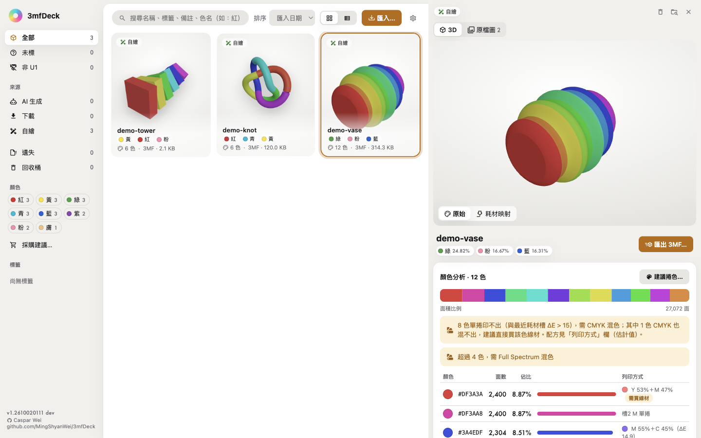
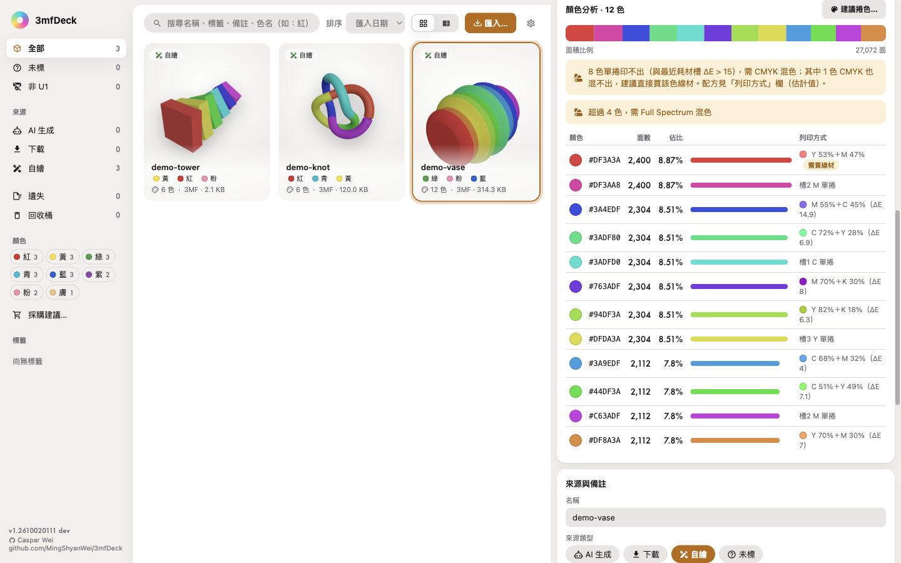
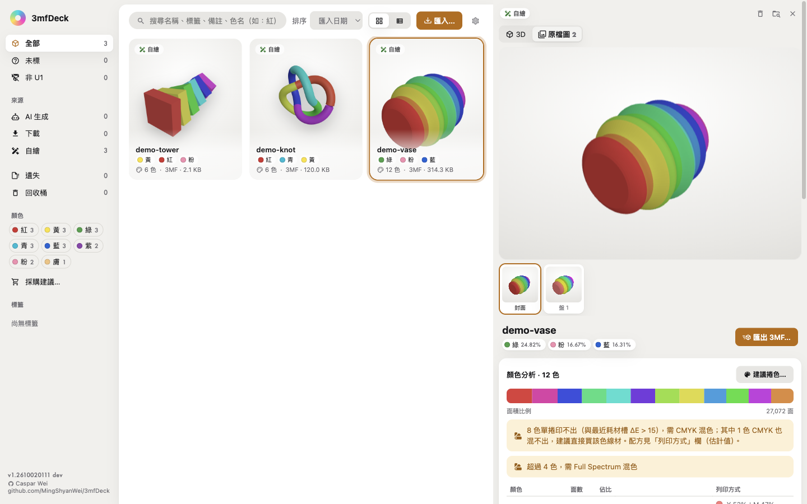
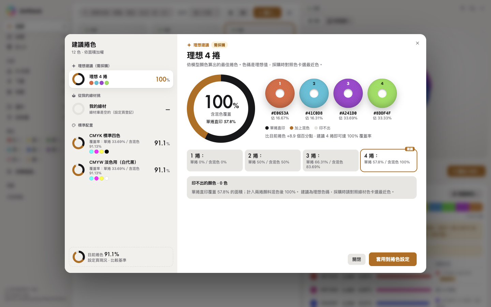
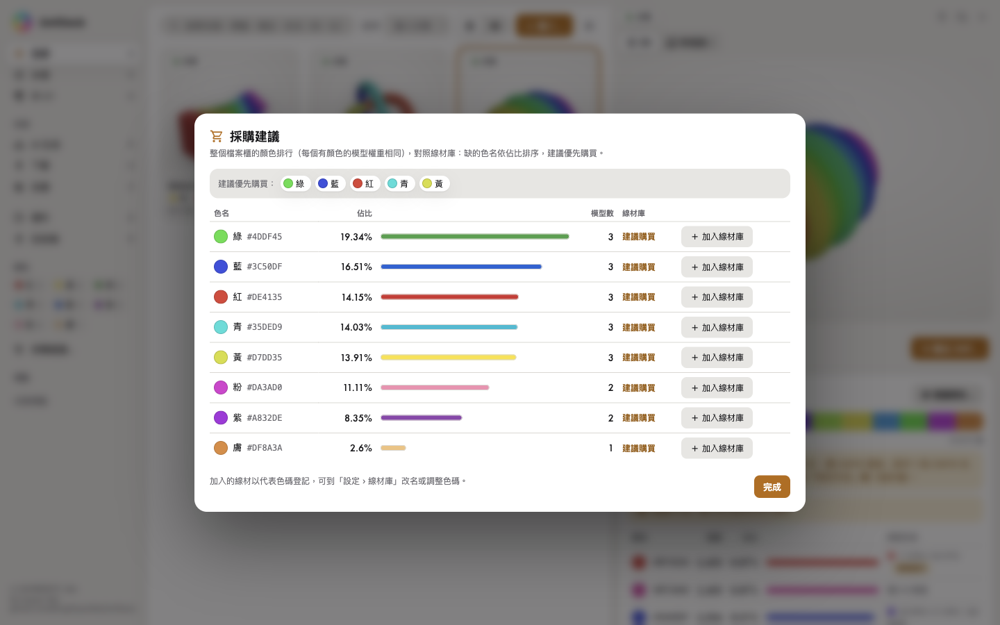

# 3mfDeck

[English](README.md) · **繁體中文** · [简体中文](README.zh-CN.md)

**離線的 3MF 檔案櫃 ＋ 線材配色參謀。**

把散在硬碟、MakerWorld、Meshy 的 3MF 檔收進一個櫃子，看得見 3D、看得懂顏色、算得出該用哪幾捲線材，最後匯出可以直接在 Snapmaker Orca 開啟列印的檔案。



---

## 為什麼做這個

下載模型很容易，之後才是麻煩：

| 痛點 | 3mfDeck 怎麼解 |
|---|---|
| 檔案四散，忘記哪個是原始檔、哪個是轉檔 | 匯入即**搬進**集中資料夾（`~/3mf-library/`，可在設定頁改根目錄），檔案系統為真、DB 只是索引 |
| 開檔才知道長什麼樣 | 櫃子裡直接 **3D 預覽**；MakerWorld 專案還能看到**創作者產品圖與實拍照** |
| 不知道這件作品要用哪幾捲線材 | **顏色分析**（面積加權）＋**建議捲色**（Lab k-means，能 3 捲就不叫你買 4 捲） |
| Full Spectrum 混色全靠猜 | 混色**偵測與配方**：兩捲顏料模型算出混出來的色與 ΔE，告訴你哪一槽幾 % |
| 匯出的 3MF 在 Orca 打開一堆警告 | **匯出 3MF**：剝除不相容的切片設定，只寫幾何＋顏色＋捲色表；混色寫入 Orca 原生 Mix 虛擬擠出頭 |
| 別人分享的檔案不是自家印表機的 | **Snapmaker U1 相容性檢查**：非 U1 檔案會警示（含來源機型），可一鍵轉換（噴嘴對應、相容性修正、多盤座標換算） |
| 刪檔手滑 | 一律進 `.trash/`，可還原，不真刪；同名不覆蓋（加 `-2`） |

---

## 主要功能

**檔案櫃**
- 匯入（選檔／資料夾／拖放）、搜尋、標籤、來源紀錄（MakerWorld／Printables／Meshy／自繪…）、排序、卡片格與表格兩種檢視
- 遺失處置：根目錄換過導致對不上時，標示「遺失」、可重新定位或移除記錄
- 多盤 3MF：每盤分開列出，可切換檢視

**3D 預覽**
- three.js 渲染，三種著色模式（原始顏色／耗材映射／混色估計）
- 詳情面板可切「原檔圖」看 3MF 內嵌的封面、創作者實拍與 Orca 盤面渲染
- 卡片縮圖優先用內嵌產品主圖，沒有才用 3D 渲染

**顏色與線材**
- 顏色分析：逐面 `paint_color`／`basematerials` 解析，面積加權佔比、抖色偵測
- 顏色標籤：自動對應固定色名（黑／白／灰／紅／橙／黃／綠／青／藍／紫／粉／棕／膚／金），可依顏色搜尋與過濾；色名用任一介面語言搜尋都找得到（「藍」「蓝」「blue」皆可）
- 線材庫：登記自己的線捲（品牌、材質、RGB、剩餘量），支援匯入 3dfilamentprofiles 的 JSON/CSV
  - 在 3dfilamentprofiles.com 登入後到 [My Spools](https://3dfilamentprofiles.com/my/spools) 匯出（JSON 或 CSV），再到「設定 › 線材庫」按 **從 3dfilamentprofiles 匯入…** 選擇下載的檔案（設定頁也列出相同步驟與 My Spools 連結）
- 建議捲色：從現有線材挑，或給理想色碼；CMYK／CMYW 標準配置比較；單色作品也建議
- 採購建議：統計整個櫃子的面積佔比，對照線材庫算出該優先買哪些顏色

**匯出**
- 匯出 3MF：量化到最近捲（含 ΔE 標示），剝除來源切片設定避免 Orca 警告
- 混色耗材：寫入 `mixed_filament_definitions`（Orca 原生 Full Spectrum 混合耗材），配方僅供參考、不回寫原檔
- 原檔永不修改，一律產新檔

**介面語言**
- English／繁體中文／简体中文，預設跟隨系統語言，可在設定頁切換並記住；日期與數字依語言格式化

**離線保證**
- App 本身**不發任何網路請求**（無帳號、無雲端、不連印表機）。唯一的外部呼叫是兩個固定連結交給系統瀏覽器開啟：側欄作者連結、設定頁的 3dfilamentprofiles.com My Spools 頁。
- 側欄左下顯示版本號 `1.<YYMMDDHHMM>`（建置時間），滑過去可看完整時間與 commit。

---

## 截圖

截圖全部使用 [`scripts/make-demo-models.mjs`](scripts/make-demo-models.mjs) 產生的示範模型（本專案自製），匯入乾淨的暫存檔案櫃；可用 `node scripts/readme-screenshots.mjs` 重新產生。花瓶的「原檔圖」是該腳本把花瓶本身的渲染圖嵌入 3MF 而來。

| | |
|---|---|
|  **顏色分析**：面積佔比、色名標籤、每色的列印方式 |  **原檔圖**：3MF 內嵌的封面與盤面圖 |
|  **建議捲色**：理想色、從線材庫挑、標準配置 |  **採購建議**：整個檔案櫃最缺哪些顏色 |

## 支援格式與環境

| 項目 | 內容 |
|---|---|
| 模型格式 | 3MF（完整支援：顏色、多盤、內嵌圖、混色）、STL、OBJ、AMF、GLB／glTF、STEP |
| 平台 | macOS（主要開發與驗證）、Windows、Linux（**見下方限制**） |
| 執行環境（開發） | Node ≥ 24（vitest／vite 在 Node 20 會崩） |

## 安裝

### 從 Releases 下載

到 [GitHub Releases](https://github.com/MingShyanWei/3mfDeck/releases) 下載對應平台的檔案（下表檔名中的 `0.1.0` 是套件版本；側欄顯示的是建置版本 `1.<YYMMDDHHMM>`）。各版檔案的 SHA256 見 [docs/release-manifest.md](docs/release-manifest.md)。

| 平台 | 檔案 | 說明 |
|---|---|---|
| macOS（Apple 晶片） | `3mfDeck-0.1.0-arm64.dmg` | 打開後把 3mfDeck 拖進「應用程式」 |
| Windows x64 | `3mfDeck Setup 0.1.0.exe` | 安裝版（可選安裝位置） |
| Windows x64 | `3mfDeck 0.1.0.exe` | 免安裝版，直接執行 |
| Linux x64 | `3mfDeck-0.1.0.AppImage` | `chmod +x` 後直接執行 |
| Linux x64（Debian／Ubuntu） | `mf-cabinet_0.1.0_amd64.deb` | `sudo apt install ./mf-cabinet_0.1.0_amd64.deb` |

**macOS：此版未簽章（僅 ad-hoc 簽章，未用 Developer ID、未公證）**，第一次開啟會被 Gatekeeper 擋下，請擇一：
- 在「應用程式」裡對 3mfDeck **右鍵 →「打開」→「打開」**；若沒有「打開」按鈕，到 **「系統設定 › 隱私權與安全性」**，按 3mfDeck 訊息旁的 **「強制打開」**；或
- 在終端機執行 `xattr -dr com.apple.quarantine /Applications/3mfDeck.app`，之後正常開啟。

若要下載後免警告開啟，需 Apple Developer Program 簽章＋公證，不在本版範圍。

**Windows：** `.exe` 也未做程式碼簽章；SmartScreen 若警告，請按「其他資訊 → 仍要執行」。

## 開發

```bash
git clone git@github.com:MingShyanWei/3mfDeck.git
cd 3mfDeck
npm install
npm run dev        # vite build + 啟動 Electron
npm test           # Vitest 單元測試（251 項）
npm run smoke      # Electron 端到端 smoke（用隔離的資料夾與資料庫）
npm run dist       # 打包 macOS dmg
```

常用環境變數（測試用）：

| 變數 | 用途 |
|---|---|
| `MF_USER_DATA` | 指定 userData 目錄（隔離測試） |
| `MF_APP_PATH` | 對安裝版 App 跑 smoke（例：`/Applications/3mfDeck.app/Contents/MacOS/3mfDeck`） |
| `MF_WINE_3MF` | 指定真實 3MF 檔做實檔驗證 |
| `MF_LANG` | 未在設定頁選過語言時使用的介面語言（`en`／`zh-TW`／`zh-CN`） |

## 專案結構

```
electron/          Electron 主程序（視窗、IPC、自訂圖片協定 mfimg/mfthumb）
src/core/          純邏輯，可單獨測試：解析、顏色、混色、匯出、轉換、DB、設定
  parse/           3MF／STL／OBJ／AMF／GLB／STEP 解析
  u1Convert.mjs    Snapmaker U1 相容性轉換
  orcaProfiles.mjs 讀本機 Snapmaker Orca 的機型 profile（僅取幾何資料，不連網）
src/core/i18n/     介面字典（en／zh-TW／zh-CN）
src/renderer/      React UI（three.js 預覽、詳情面板、彈窗）
tests/unit/        Vitest（30 個檔、251 項）
tests/smoke/       真實 Electron 端到端測試
docs/screenshots/  README 截圖（en／zh-TW／zh-CN）
demo/models/       程序化產生的示範模型（可用 node scripts/make-demo-models.mjs 重新產生）
scripts/           測試素材、示範模型與截圖產生腳本
SPEC.md            完整功能規格（已定稿）
```

## 設計原則

1. **檔案系統為真**：DB 只是索引，刪掉能從檔案重建。
2. **刪檔不真刪**：一律進 `.trash/`，可還原。
3. **原檔永不動**：匯出、轉換都產新檔。
4. **匯入即搬檔**：集中管理，不搬不給匯入。
5. **離線**：任何功能都不需要網路。

## 已知限制

- **Windows／Linux 未有實機驗證**：安裝檔是在 macOS 上用 electron-builder 內建的 Wine／Linux 工具組（或 CI runner）產出，尚未在實機跑過 smoke；macOS 是唯一完成端到端驗證的平台。
- **Orca CLI 不能用來驗 3MF**：沒載印表機 profile 會 segfault（`exit 139`），連原始檔也一樣。驗證一律以 **Orca GUI 開啟**為準。
- **混色配方無法逐面寫兩捲**：Orca 逐面只記一捲，因此混色以虛擬擠出頭（Mix）表達。
- **大檔案**：內含 500MB 以上模型（如某些 Meshy 匯出）需用串流解析，處理時間較長。

## License

**MIT** — see [LICENSE](LICENSE).

Third-party components keep their own licenses; see the notices in [LICENSE](LICENSE).
In short: the pigment mixing model is MIT (Justin Hayes, ported from
[OrcaSlicer-FullSpectrum](https://github.com/ratdoux/OrcaSlicer-FullSpectrum)); the
Snapmaker U1 conversion is original to this project and reads machine geometry from a
locally installed Snapmaker Orca at runtime.

## Author

**Caspar Wei** ([@MingShyanWei](https://github.com/MingShyanWei)) — [github.com/MingShyanWei/3mfDeck](https://github.com/MingShyanWei/3mfDeck)
